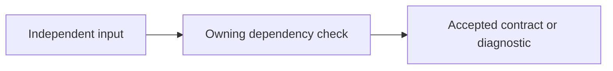

# Tests

Dependency observer fixtures verify source ownership and configured requirements without compiling the fixture.

```mermaid
flowchart LR
  Input[Independent input] --> Check[Owning dependency check]
  Check --> Result[Accepted contract or diagnostic]
```
