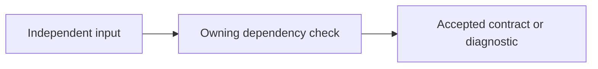

# Tests

Policy tests inject independent forbidden edges; passing the production inventory alone would not exercise rejection.

```mermaid
flowchart LR
  Input[Independent input] --> Check[Owning dependency check]
  Check --> Result[Accepted contract or diagnostic]
```
